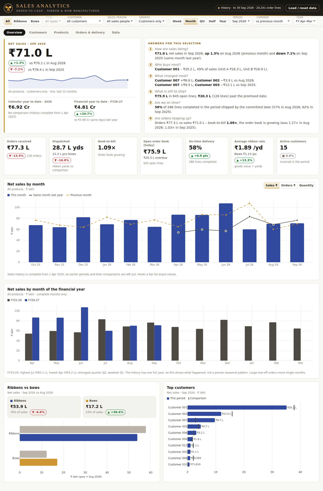
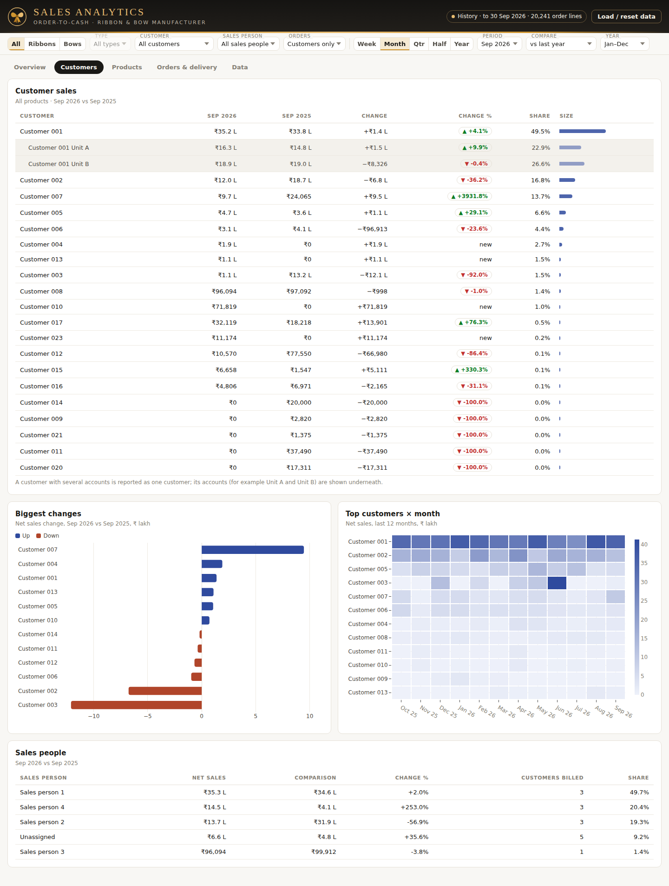
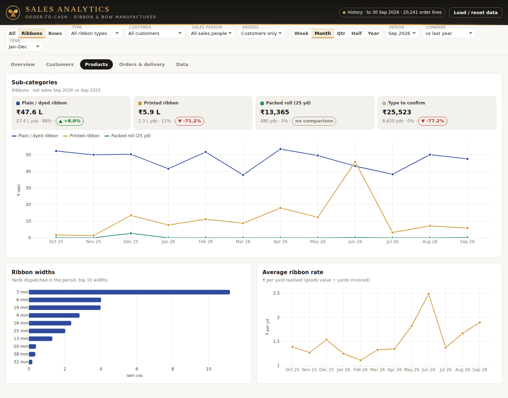
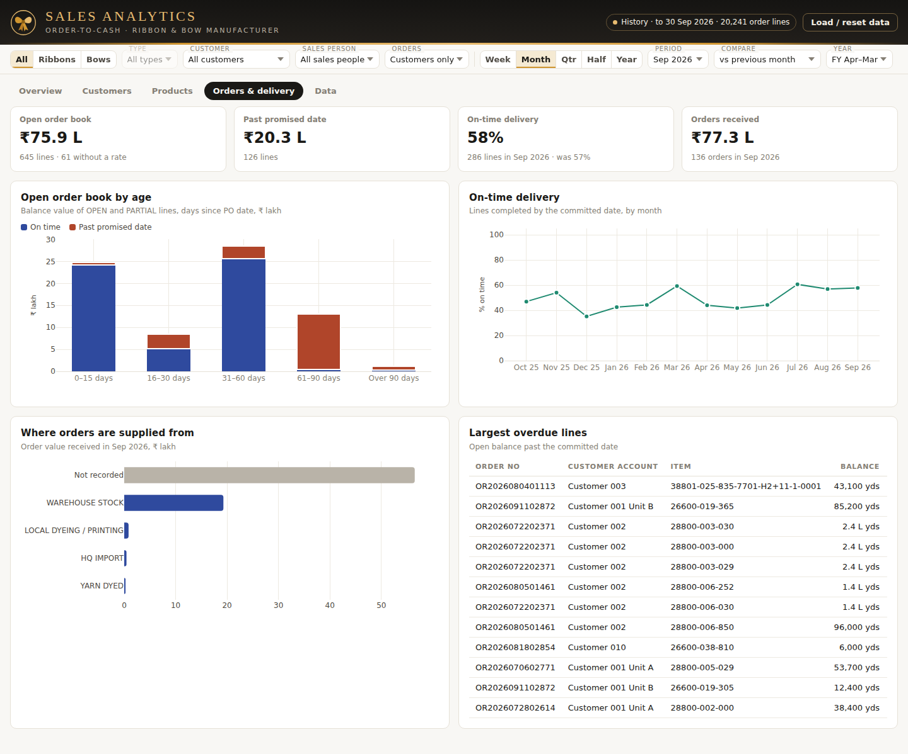
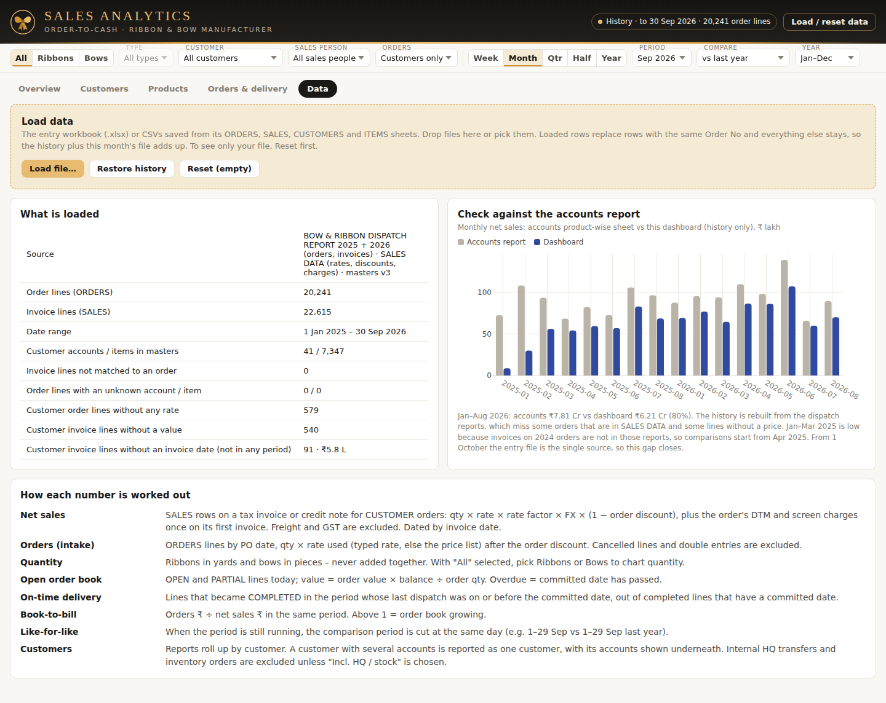
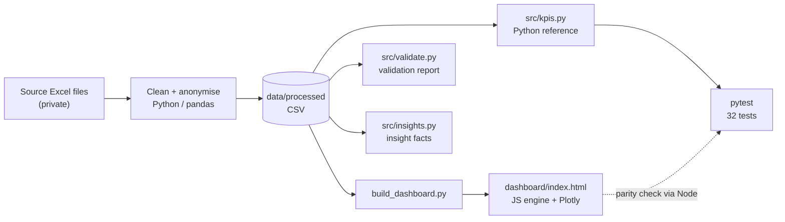

# Sales Analytics Dashboard — Order-to-Cash

   

**One trusted view of orders, sales, open book and delivery for a B2B ribbon & bow manufacturer — built from three disagreeing Excel sources, with every KPI defined, tested and reconciled to the accounts report.**



*Real order-to-cash data, anonymised (company, customers and staff are aliased). **[Open the live dashboard](https://krishnasai-pentakota.github.io/sales-analytics-dashboard/)**, or open `dashboard/index.html` locally.*

## Business problem
Orders, dispatches and the accounts report lived in separate files that were never reconciled. Stock transfers to head office looked like sales, order-level charges were easy to double count, and a half-finished month was compared with a full one. Management could not say, from one place, how much was sold, to whom, what was still open and whether deliveries were on time.

## What it answers
- Are we up or down on last year — on a like-for-like basis?
- Which customers and product types drive sales, and how concentrated is it?
- How much is ordered but not shipped, and how much is past its promised date?
- Do we deliver on time?
- Can the numbers be trusted? (reconciliation to the accounts report)

## Key insights (from the data)
| | |
|---|---|
| **FY 2026-27 to date** | ₹4.81 Cr, **+20.7 %** vs the same days last year — but September is −7.1 % (₹71.0 L vs ₹76.4 L) |
| **June 2026 spike** | ₹107.3 L (+88.5 %) was one customer (38.5 %) and printed ribbon (₹45.8 L vs ₹2.6 L) — a one-off, corroborated by the accounts report |
| **Concentration** | Top 3 customers = **72 %** of sales, top 1 = 40 % |
| **Delivery** | On-time **58 %** in September; a committed date exists on only **47 %** of order lines |
| **Open order book** | ₹75.9 L across 645 lines; ₹20.3 L past the promised date |
| **Coverage** | Dashboard = **80 %** of accounts-report value for Jan–Aug 2026 (stated, not hidden) |

Each with Finding / Evidence / Interpretation / Action: [`docs/business_insights.md`](docs/business_insights.md).

## Dashboard
| | |
|---|---|
|  **Customers** — who drives it, who is slipping |  **Products** — mix, widths, realised rates |
|  **Orders & delivery** — open book, overdue, on-time |  **Data** — coverage and reconciliation |

Tab-by-tab guide: [`docs/dashboard_guide.md`](docs/dashboard_guide.md).

## KPI framework
| KPI | Definition (short) |
|---|---|
| Net sales | Invoiced goods value + once-per-order charges, customer orders only, ex-GST |
| Orders received | Order-line value by PO date, excluding cancelled / double entries |
| Book-to-bill | Orders received ÷ net sales |
| Open order book / overdue | Balance value of open and part-shipped lines / those past the committed date |
| On-time delivery | Completed lines whose last dispatch ≤ committed date |
| Average rate | Goods value ÷ yards (ribbon) or pieces (bows) |
| Top-customer share | Customer net sales ÷ total |

Full formulas: [`docs/metric_dictionary.md`](docs/metric_dictionary.md).

## Data and transformation
Six processed files in [`data/processed/`](data/processed) (20,241 order lines · 22,615 invoice lines · 41 accounts · 7,347 items), Jan 2025 – Sep 2026. Transformation rules — linking invoices to orders, unit and FX conversion, charge allocation, status tolerance — are in [`docs/methodology.md`](docs/methodology.md); fields in [`docs/data_dictionary.md`](docs/data_dictionary.md).

## Architecture (current)


## AI and production architecture
**Current implementation** — everything above: Excel → Python/pandas → CSV → a single-file dashboard, a tested Python reference and a validation report. No machine learning and no database are in this repository.

**Future production architecture (proposal, not built):**
```
CRM / order entry → cloud storage → ETL → warehouse → semantic (metric) layer → BI → ML / AI services
```
| Layer | Purpose |
|---|---|
| Warehouse + scheduled ETL | Replace manual monthly loads; keep the same order-to-cash rules as SQL models |
| Semantic metric layer | One governed definition per KPI (today: the metric dictionary + two tested implementations) |
| Forecasting | Monthly sales forecast by product type, with a baseline to beat |
| Anomaly alerts | e.g. a top-five customer falling by more than half, as happened with one customer in September |
| Natural-language Q&A | Questions answered from the metric layer, not from raw tables |

## Technology stack (as used)
Excel workbooks · Python 3.11 (pandas, numpy) · HTML / CSS / JavaScript · Plotly.js and SheetJS (CDN) · Node.js (runs the dashboard engine for the parity test) · pytest · Playwright (screenshots). No SQL, warehouse or BI server is used.

## Repository structure
```
README.md
dashboard/   index.html (built) · template.html (source)
data/        processed/ (CSV, anonymised) · README.md
docs/        business_context · data_dictionary · metric_dictionary · methodology
             dashboard_guide · business_insights · interview_guide
             validation_report · insight_facts
screenshots/ five dashboard captures
src/         build_dashboard · kpis · validate · insights · engine_reference.js · make_screenshots
tests/       test_kpis.py · fixtures/engine_reference.json
```

## How to run
```bash
python -m venv .venv && source .venv/bin/activate      # Windows: .venv\Scripts\activate
pip install -r requirements.txt

python -m pytest -q tests            # 32 tests (engine parity runs if Node.js is installed)
python -m src.validate               # rewrites docs/validation_report.md
python -m src.insights               # prints the facts behind docs/business_insights.md
python src/build_dashboard.py        # rebuilds dashboard/index.html from data/processed
```
Then open `dashboard/index.html` (needs internet once for the Plotly / SheetJS CDN scripts). Screenshots: `python src/make_screenshots.py --plotly <path to plotly.min.js> --chromium <path to chrome>` after `playwright install chromium`.

## Validation
32 passing tests and a [validation report](docs/validation_report.md): completeness, validity, uniqueness, integrity, calculation identities and a monthly reconciliation to the accounts report. Key results: 0 unmatched invoice lines; customer totals add up to the grand total; 579 order lines (2.9 %) cannot be valued; committed date missing on 53 %.

## Business value
A single, documented definition of each number; early sight of customer concentration and of drop-off at a top account; a visible open book and overdue list; and an honest statement of what the data does and does not cover.

## Limitations and assumptions
- **Sales (order-to-cash) analytics only.** There is no marketing spend, lead or channel data, so no marketing ROI is claimed.
- History covers ~80 % of accounts-report value for Jan–Aug 2026; comparisons are reliable from April 2025.
- Committed date on 47 % of lines, supply source on ~50 %; 56 % of accounts have no sales person.
- USD accounts convert at a placeholder ₹88. No cost or margin. No credit notes in this dataset.
- Anonymised: names are aliases; quantities, rates and dates are as recorded.

## Future enhancements (not built)
Warehouse-backed pipeline and scheduled refresh; forecasting; customer-drop alerts; margin once cost data exists; committed-date and sales-person capture at entry (started with the 1 Oct 2026 entry workbook).

## Interview talking points
See [`docs/interview_guide.md`](docs/interview_guide.md) for the 60-second and 2-minute explanations and grounded answers.

## License
MIT
