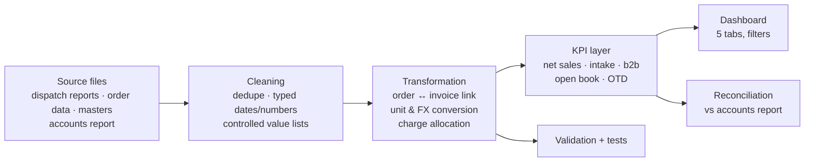

# Methodology

## 1. Source → processed
Private source workbooks were cleaned and anonymised by a one-off script (not published: it holds the real-name mapping). Output: six files in `data/processed/` (see `data/README.md`). The dashboard build (`src/build_dashboard.py`) embeds them as a compact payload in a single HTML file.

## 2. Cleaning rules
- Item codes upper-cased; dates and numbers typed.
- Order type, document type and status override are controlled lists; anything outside the list fails validation.
- `CANCELLED` and `DOUBLE ENTRY` orders are excluded from intake; all other statuses stay visible.
- Repeated items on an order are distinguished by an occurrence number, so there are no duplicate line keys.

## 3. Transformation
1. **Link** each invoice line to its order line on order + item + occurrence. All 22,615 match.
2. **Value** each line in rupees: quantity × rate × unit factor × FX × (1 − discount). Rate falls back from invoice → order → price list.
3. **Allocate charges** (DTM, screen) once per order to its first tax invoice.
4. **Classify** as customer or internal; only customer lines count.
5. **Status**: dispatched quantity vs ordered, tolerance 5 %, manual overrides win.

## 4. KPI layer
Definitions in [`metric_dictionary.md`](metric_dictionary.md). Implemented twice on purpose: in JavaScript (the dashboard) and in pandas (`src/kpis.py`).

## 5. Validation
- `python -m src.validate` → [`validation_report.md`](validation_report.md): completeness, validity, uniqueness, integrity, calculation identities, reconciliation.
- `pytest` → 34 tests, including **parity between the Python and JavaScript engines** on net sales, orders, OTD, open book and book-to-bill across seven filter cases.

## 6. Reconciliation result
Dashboard vs accounts report, Jan–Aug 2026: ₹6.21 Cr vs ₹7.81 Cr (**80 %**), monthly coverage 69–91 %. Earlier 2025 months are lower because invoices on 2024 orders are absent from the dispatch reports; comparisons therefore start in April 2025.

## Assumptions
| Assumption | Why it matters |
|---|---|
| USD accounts convert at ₹88 (placeholder) | Affects the one USD account from go-live; rate to be confirmed. |
| Completion tolerance 5 % | A line shipped at 95 % counts as complete. |
| Order discount = largest % on any line of the order | Two values in history (2 %, 5 %). |
| Lines with no rate and no price-list rate carry no value | 579 lines (2.9 %), shown on the Data tab. |
| Internal HQ orders are not sales | Excluded by default; can be toggled on. |

## Limitations
No margin or cost data; committed date on 47 % of lines; supply source on ~50 %; 56 % of accounts without a sales person; history is 80 % of accounts-report value; no credit notes in the dataset, so credit-note logic is tested on rules, not on real examples.
